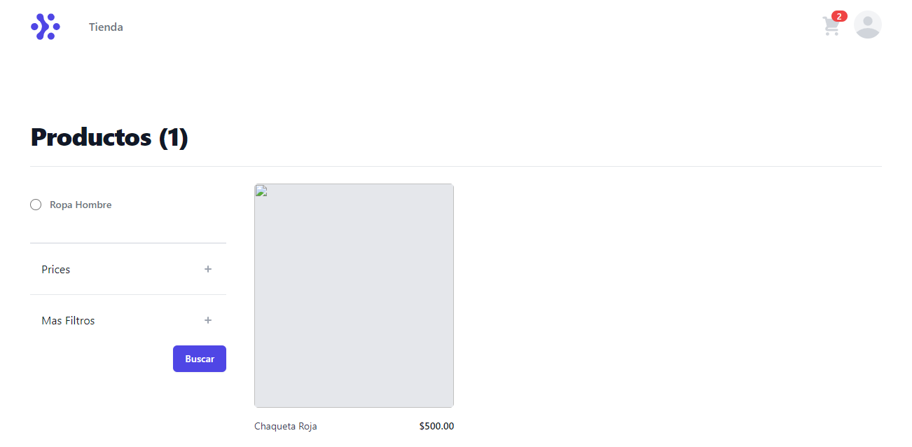
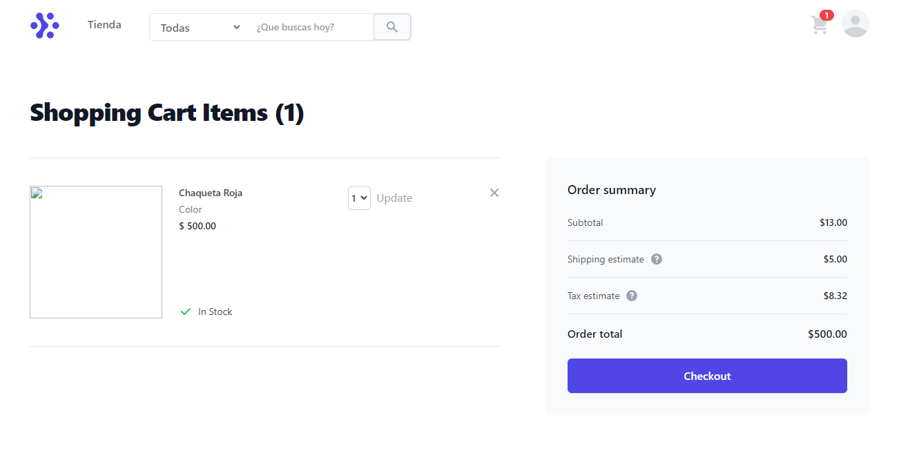

# API Rest-Framework

Take a hands-on with Django, postgrest, and React redux to observe and learn how APIs work.

## Structure

- APIproject is the Back-End 
- Front-End is where are the templates in react
- docs are all the screenshots of the application.
- env1 is the virtual Enviroment

## operations

1. [x] Create
1. [x] Read

## Tools

- postgrest
- Tailwind
- Python
- react redux

